# Vue - vue create、vue ui、vue init三种方式创建Vue项目
## 安装@vue/cli
为npm安装的包配置环境变量

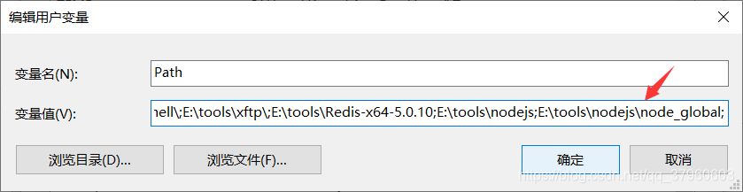

运行下面这条命令。

> npm install -g @vue/cli


在CMD中运行vue --version命令，如果输出了@vue/cli的版本，则说明@vue/cli安装成功了。

>C:\Users\Kaven>vue --version
>@vue/cli 4.5.9
>
>

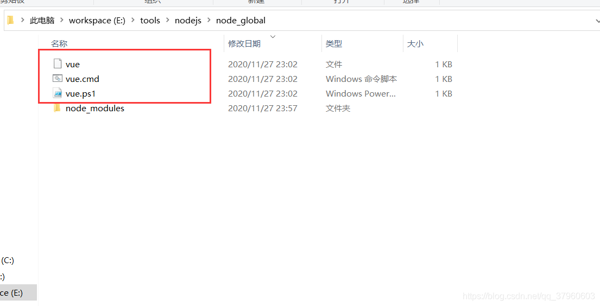


# 创建Vue项目 - vue create
通过下面这条命令可以查看vue create命令的说明。

> vue create -h

```bat
E:\workspace\WebStorm\blog\project>vue create -h
Usage: create [options] <app-name>

create a new project powered by vue-cli-service

Options:
  -p, --preset <presetName>       Skip prompts and use saved or remote preset
  -d, --default                   Skip prompts and use default preset
  -i, --inlinePreset <json>       Skip prompts and use inline JSON string as preset
  -m, --packageManager <command>  Use specified npm client when installing dependencies
  -r, --registry <url>            Use specified npm registry when installing dependencies (only for npm)
  -g, --git [message]             Force git initialization with initial commit message
  -n, --no-git                    Skip git initialization
  -f, --force                     Overwrite target directory if it exists
  --merge                         Merge target directory if it exists
  -c, --clone                     Use git clone when fetching remote preset
  -x, --proxy <proxyUrl>          Use specified proxy when creating project
  -b, --bare                      Scaffold project without beginner instructions
  --skipGetStarted                Skip displaying "Get started" instructions
  -h, --help                      output usage information
```


通过下面这条命令来创建Vue项目project。

>vue create project


选择Vue的版本。


创建Vue项目。

```


E:\workspace\WebStorm\blog\project>vue create project

Vue CLI v4.5.9
? Please pick a preset: Default ([Vue 2] babel, eslint)

Vue CLI v4.5.9
✨  Creating project in E:\workspace\WebStorm\blog\project\project.
🗃  Initializing git repository...
⚙️  Installing CLI plugins. This might take a while...


> yorkie@2.0.0 install E:\workspace\WebStorm\blog\project\project\node_modules\yorkie
> node bin/install.js

setting up Git hooks
done


> core-js@3.8.0 postinstall E:\workspace\WebStorm\blog\project\project\node_modules\core-js
> node -e "try{require('./postinstall')}catch(e){}"


> ejs@2.7.4 postinstall E:\workspace\WebStorm\blog\project\project\node_modules\ejs
> node ./postinstall.js

added 1248 packages from 938 contributors in 33.831s

61 packages are looking for funding
  run `npm fund` for details

🚀  Invoking generators...
📦  Installing additional dependencies...

added 53 packages from 36 contributors in 6.473s

65 packages are looking for funding
  run `npm fund` for details

⚓  Running completion hooks...

📄  Generating README.md...

🎉  Successfully created project project.
👉  Get started with the following commands:

$ cd project
$ npm run serve


```


运行项目。

```
E:\workspace\WebStorm\blog\project>cd project

E:\workspace\WebStorm\blog\project\project>npm run serve

> project@0.1.0 serve E:\workspace\WebStorm\blog\project\project
> vue-cli-service serve

 INFO  Starting development server...
98% after emitting CopyPlugin

 DONE  Compiled successfully in 1973ms                             


  App running at:
  - Local:   http://localhost:8080/
  - Network: http://192.168.1.103:8080/

  Note that the development build is not optimized.
  To create a production build, run npm run build.

```


访问http://localhost:8080/得到如下图所示页面，说明Vue项目已经运行成功了。

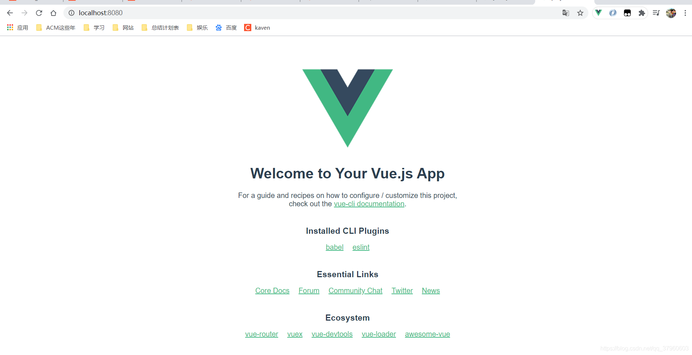

# 创建Vue项目 - vue ui
## vue ui命令的说明。

```
E:\workspace\WebStorm\blog\project>vue ui -h
Usage: ui [options]

start and open the vue-cli ui

Options:
  -H, --host <host>  Host used for the UI server (default: localhost)
  -p, --port <port>  Port used for the UI server (by default search for available port)
  -D, --dev          Run in dev mode
  --quiet            Don't output starting messages
  --headless         Don't open browser on start and output port
  -h, --help         output usage information

```


通过下面这条命令来打开一个管理Vue项目的可视化页面。

>  vue ui
> 

```
1E:\workspace\WebStorm\blog\project>vue ui
🚀  Starting GUI...
🌠  Ready on http://localhost:8000

```


出现如下图所示页面，可以管理现有的Vue项目、创建新的Vue项目、导入Vue项目。

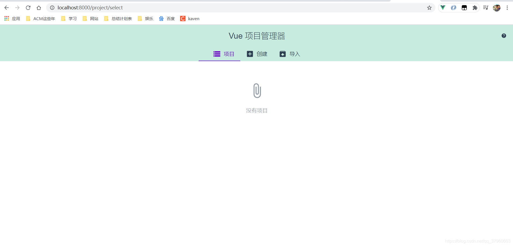


选择创建，点击在此创建新项目。

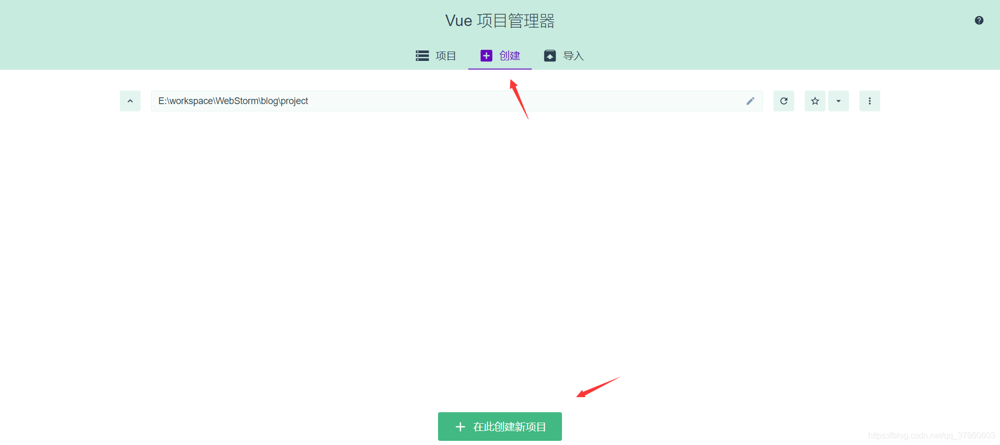

输入项目名，选择包管理器，默认初始化git仓库，点击下一步。

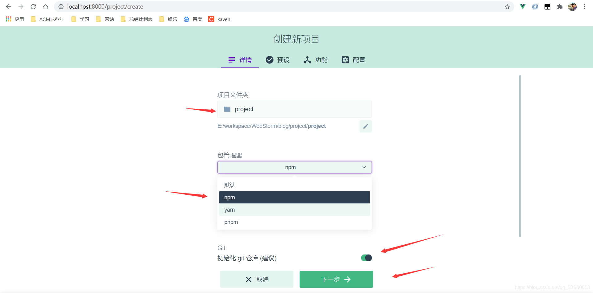

选择Vue版本，点击创建项目。

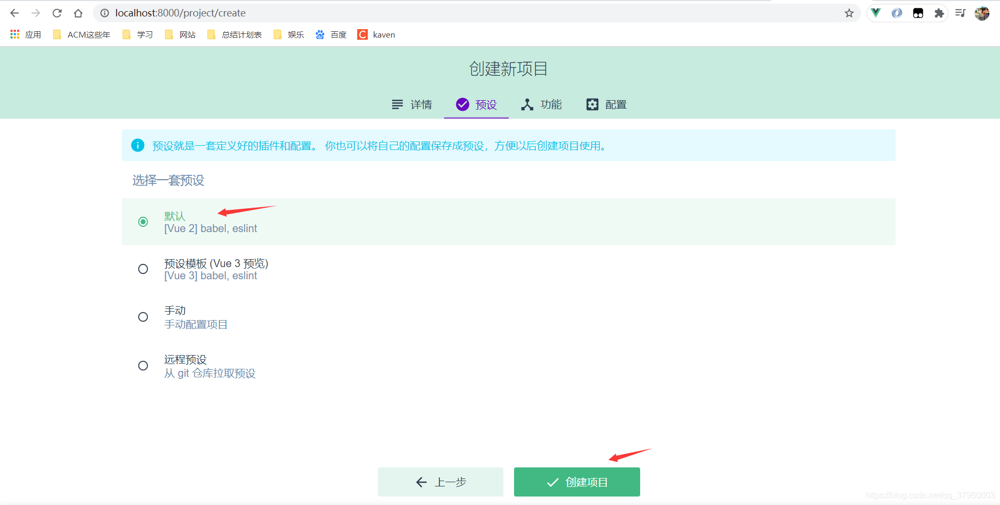

项目创建成功，得到如下图所示页面。

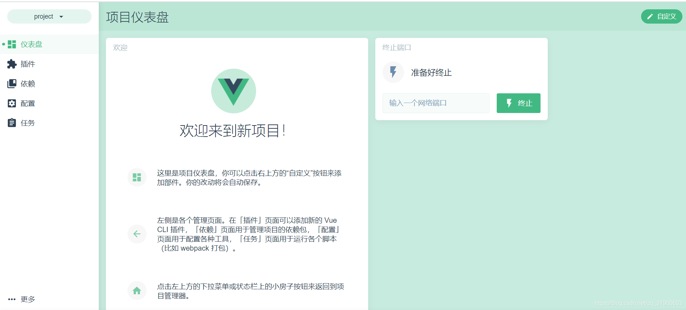

可以查看项目的依赖。

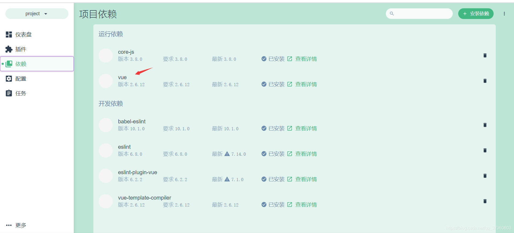

还可以添加插件。

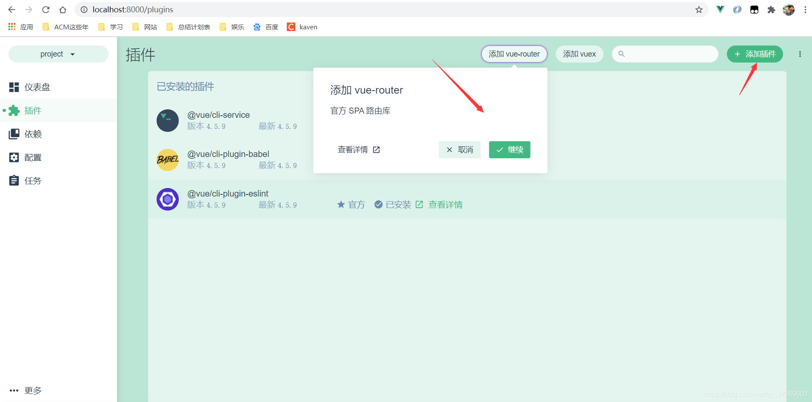

运行项目。

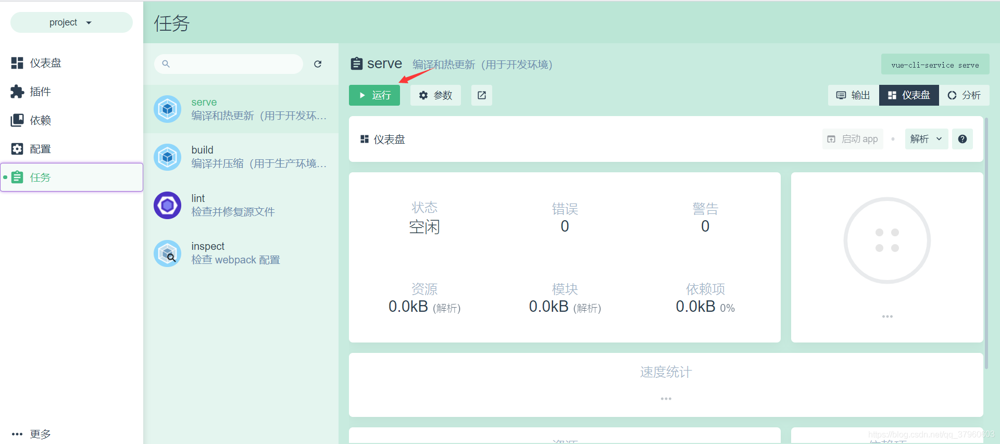

项目运行成功。

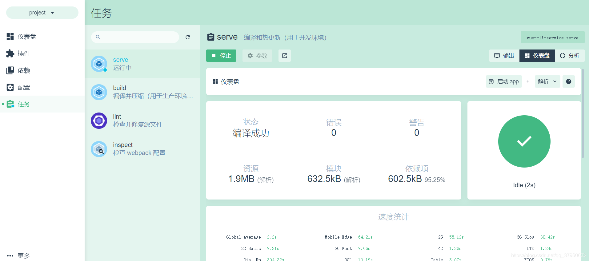访问项目。

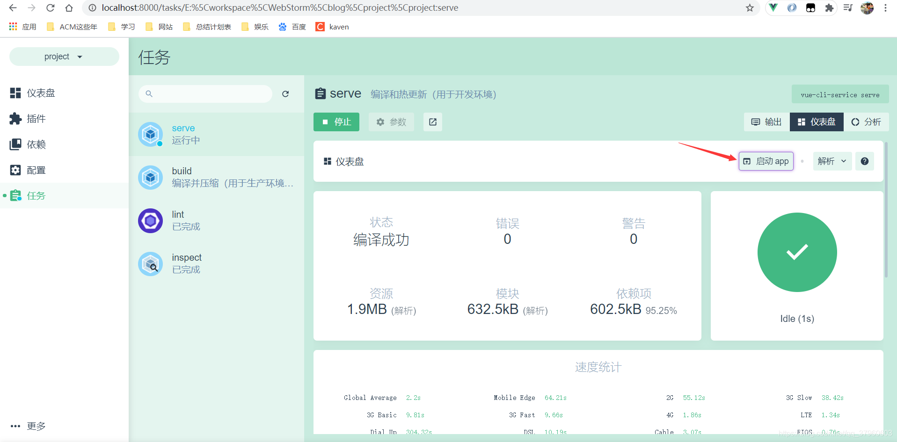项目可以正常访问。

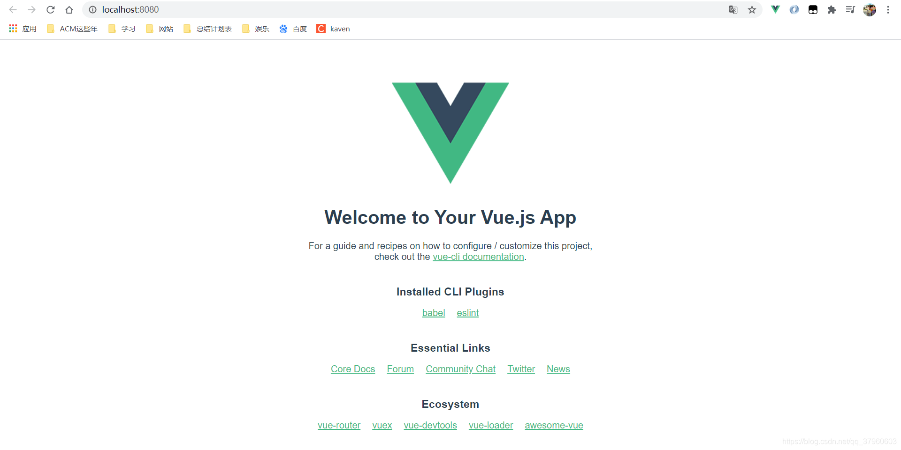


# 创建Vue项目 - vue init

## 先安装@vue/cli-init。

```
E:\workspace\WebStorm\blog\project>npm i -g @vue/cli-init
...

+ @vue/cli-init@4.5.9
  added 251 packages from 206 contributors in 18.065s
```

## vue init命令的说明。

```
E:\workspace\WebStorm\blog\project>vue init -h
Usage: init [options] <template> <app-name>

generate a project from a remote template (legacy API, requires @vue/cli-init)

Options:
  -c, --clone  Use git clone when fetching remote template
  --offline    Use cached template
  -h, --help   output usage information

```


还可以通过下面这条命令来创建Vue项目，这里的webpack参数是一种模板（template），project参数就是项目名称（app-name）。

> vue init webpack project


```
E:\workspace\WebStorm\blog\project>vue init webpack project

? Project name project
? Project description A Vue.js project
? Author ITKaven <xxxxxxxx@qq.com>
? Vue build standalone
? Install vue-router? Yes
? Use ESLint to lint your code? Yes
? Pick an ESLint preset Standard
? Set up unit tests No
? Setup e2e tests with Nightwatch? No
? Should we run `npm install` for you after the project has been created? (recommended) npm

   vue-cli · Generated "project".

# Installing project dependencies ...

added 1380 packages from 715 contributors in 31.707s

41 packages are looking for funding
  run `npm fund` for details

Running eslint --fix to comply with chosen preset rules...

# ========================


> project@1.0.0 lint E:\workspace\WebStorm\blog\project\project
> eslint --ext .js,.vue src "--fix"


# Project initialization finished!

# ========================

To get started:

  cd project
  npm run dev

Documentation can be found at https://vuejs-templates.github.io/webpack
```


运行项目。


```
E:\workspace\WebStorm\blog\project>cd project

E:\workspace\WebStorm\blog\project\project>npm run dev

> project@1.0.0 dev E:\workspace\WebStorm\blog\project\project
> webpack-dev-server --inline --progress --config build/webpack.dev.conf.js

 13% building modules 26/31 modules 5 active ...torm\blog\project\project\src\App.vue{ parser: "babylon" } is deprecated; we now treat it as { parser: "babel" }.
 95% emitting

 DONE  Compiled successfully in 2614ms                                                                      下午11:53:24

 I  Your application is running here: http://localhost:8080

```


访问http://localhost:8080/得到如下图所示页面，说明Vue项目已经运行成功了。

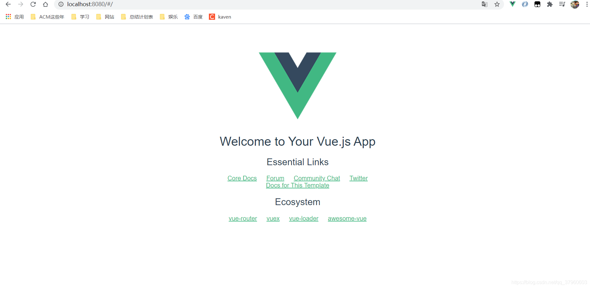

# 区别
## vue create

vue creat命令是vue-cli3.x提供创建Vue项目的方式，模板是固定的，模板选项可自由配置。

使用方式：vue create [options] <app-name>。

## vue ui

vue ui命令也是vue-cli3.x提供创建Vue项目的方式，可以通过操作可视化页面来创建和管理Vue项目。

## vue init

vue init命令是vue-cli2.x提供创建Vue项目的方式，可以使用github上面的一些模板来初始化项目。比如webpack就是官方推荐的标准模板。

使用方式：vue init [options] <template> <app-name>。

vue create、vue ui、vue init三种方式创建Vue项目就介绍到这里。


原文链接：https://blog.csdn.net/qq_37960603/article/details/110262834