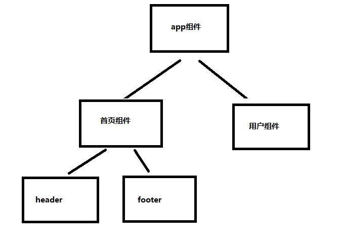

# 【第十一讲】Vue3.x父组件主动获取子组件的数据和执行子组件方法 、子组件主动获取父组件的数据和执行父组件方法

 发布于 3 年前 作者 [phonegap100](http://bbs.itying.com/user/phonegap100) 2462 次浏览 最后一次编辑是 3 年前 来自 Vue3教程

### 一、父子组件介绍



### 二、Vue3.x父组件主动获取子组件的数据和执行子组件方法

#### 2.1、调用子组件的时候定义一个ref

```
   <v-header ref="header"></v-header>
```

#### 2.2、父组件主动获取子组件数据

```
this.$refs.header.属性
```

#### 2.3、父组件主动执行子组件方法

```
this.$refs.header.方法
```

### 三、子组件主动获取父组件的数据和执行父组件方法

#### 3.1、子组件主动获取父组件的数据

```
 this.$parent.数据
```

#### 3.3、子组件主动获取父组件的数据

```
this.$parent.方法
```