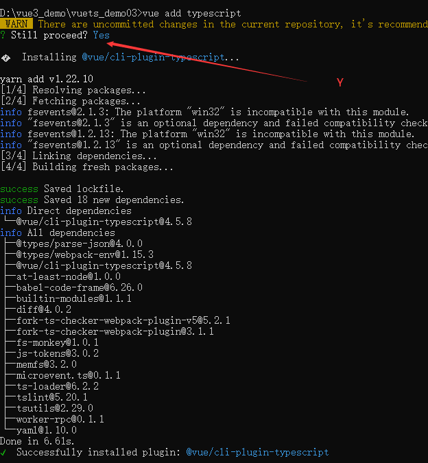

# 【第20-21讲】Vue3.x中集成Typescript 使用Typescript

 发布于 3 年前 作者 [phonegap100](http://bbs.itying.com/user/phonegap100) 3065 次浏览 最后一次编辑是 3 年前 来自 Vue3教程

### 一、Vue3.x集成Typescript

**Ts基础教程**：https://www.itying.com/goods-905.html

```bash
# 1. Install Vue CLI, if it's not already installed
npm install --global @vue/cli

# 2. Create a new project, then choose the "Manually select features" option
vue create my-project-name

# If you already have a Vue CLI project without TypeScript, please add a proper Vue CLI plugin:
vue add typescript
```





### 二、Vue3.x集成Typescript后定义组件

vue3.x中集成ts后请确保组件的 `script` 部分已将语言设置为 TypeScript

```
<script lang="ts">
  ...
</script>
```

要让 TypeScript 正确推断 Vue 组件选项中的类型，需要使用 `defineComponent` 全局方法定义组件

```ts
import { defineComponent } from 'vue'

const Component = defineComponent({
  // 已启用类型推断
})
```

#### **1、定义一个基于ts的Home组件**

```
<template>
<div>
    home组件
    <br>
    {{book.title}}
    <br>
    {{book.author}}
    <br>
    {{book.year}}
    <br>

</div>
</template>

<script lang="ts">
import {
    defineComponent
} from 'vue';

export default defineComponent({
    name: 'App',
    data() {
        return {
            book: {
                title: 'Vue 3 Guide',
                author: 'Vue Team',
                year: 2020
            }
        }
    }

});
</script>

<style>

</style>
```

#### 2、定义一个接口约束Home组件中data的数据类型

```
<template>
<div>
    home组件
    <br />
    {{ book.title }}
    <br />
    {{ book.author }}
    <br />
    {{ book.year }}
    <br />
</div>
</template>

<script lang="ts">
import {
    defineComponent
} from 'vue';

interface Book {
    title: string
    author: string
    year: number
}
var book: Book = {
    title: 'Vue 3 Guide',
    author: 'Vue Team',
    year: 2020
}
export default defineComponent({
    name: 'App',
    data() {
        return {
            book
        }
    }

});
</script>
<style>
</style>
```

#### **3、方法、计算属性中约束数据类型**

```
<template>
<div>
    home组件
    <br /> <br />
    {{ book.title }}
    <br /> <br />
    {{ book.author }}
    <br /> <br />
    {{ book.year }}
    <br /> <br />

    <button @click="setTitle()">设置数据</button>
    <br /> <br />

    {{greeting}}

</div>
</template>

<script lang="ts">
import {
    defineComponent
} from 'vue';

interface Book {
    title: string
    author: string
    year: number
}
var book: Book = {
    title: 'Vue 3 Guide',
    author: 'Vue Team',
    year: 2020
}
export default defineComponent({
    name: 'App',
    data() {
        return {
            book
        }
    },
    methods: {
        setTitle(): void {
            this.book.title = "你好vue3.0"
        }
    },
    computed: {
        // 需要注释
        greeting(): string {
            return this.book.title + '!'
        }
    }
});
</script>

<style>
</style>
```

### 三、Vue3.x集成Typescript与组合式 API 一起使用

```
<template>
<div>
    home组件
</div>
</template>

<script lang="ts">
import {
    defineComponent,
    ref,
    reactive
} from 'vue';

interface Book {
    title: string
    year ? : number
}
export default defineComponent({
    name: 'App',
    setup() {
        const year1 = ref < string | number > ('2020');

        const book1 = reactive < Book > ({
            title: 'Vue 3 Guide'
        })
        // or
        const book2: Book = reactive({
            title: 'Vue 3 Guide'
        })
        // or
        const book3 = reactive({
            title: 'Vue 3 Guide'
        }) as Book

        return {
            year1,
            book1,
            book2,
            book3
        }

    }
});
</script>

<style>
</style>
```