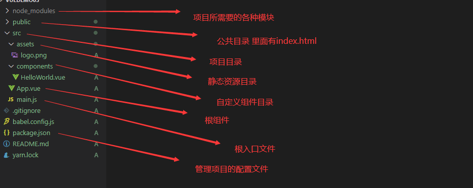
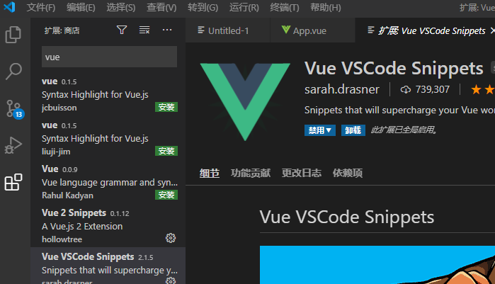

# 【第一讲】Vue3.x教程、Vue3.x简介、搭建Vue3.x环境、创建运行Vue3.x项目、分析Vue目录结构

 发布于 3 年前 作者 [phonegap100](http://bbs.itying.com/user/phonegap100) 6207 次浏览 最后一次编辑是 3 年前 来自 Vue3教程

## 一、Vue介绍

Vue (读音 /vjuː/，类似于 **view**) 是一套用于构建用户界面的**渐进式框架**。与其它大型框架不同的是，Vue 被设计为可以自底向上逐层应用。Vue 的核心库只关注视图层，不仅易于上手，还便于与第三方库或既有项目整合。目前最新版本是Vue3.x。

Vue3.x发布于2020年9月19日，在Vue2.x的基础上面进行了一些优化，对TypeScript有更好的支持。Vue3.x的语法和Vue2.x非常相似，如果你已经会用Vue2.x，那么学Vue3.x会非常简单。

**Vue 官网地址**：https://cn.vuejs.org/

**Vue3.x Githtub地址:** https://github.com/vuejs/vue-next

**Vue3.x 文档地址:** https://v3.vuejs.org/

**Vue3.x 中文文档地址**：https://v3.cn.vuejs.org/

## 二、安装Vue官方脚手架以及创建项目

**注意:**    安装脚手架创建项目之前之前，我们的电脑上必须得安装Nodejs，推荐安装nodejs稳定版本

**文档地址：** https://v3.vuejs.org/guide/installation.html#cli

**Vue-cli地址：** https://cli.vuejs.org/

**Vite地址：** https://github.com/vitejs/vite

通过Vue-cli脚手架工具可以让我们快速的搭建vue项目，目前Vue官方给我们提供了2个脚手架，Vue-cli和Vite。

#### 一、通过Vue-cli创建我们的项目

**1.1、安装Vue-cli，在同一个电脑上面只需要安装一次**

```bash
yarn global add @vue/cli
# OR
npm install -g @vue/cli
# OR
cnpm install -g @vue/cli
```

如果电脑上面没有安装过cnpm可以通过下面命令安装：

```
npm install -g cnpm --registry=https://registry.npm.taobao.org
```

如果电脑上面没有安装过yarn可以通过下面命令安装：

```
npm i -g yarn
```

**1.2、通过Vue-cli创建项目**

```
vue create hello-vue3

yarn serve
```

#### 二、通过Vite脚手架创建我们的项目

**2.1、使用npm创建**

```bash
npm init vite-app <project-name>
cd <project-name>
npm install
npm run dev
```

**2.2、使用yarn创建**

```
yarn create vite-app <project-name>
cd <project-name>
yarn
yarn dev
```

## 三、目录结构介绍



### 四、开发工具以及插件配置

