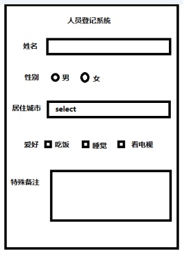

# 【第五讲】Vue3.x中Dom操作$refs 以及表单（ input、checkbox、radio、select、 textarea ）结合双休数据绑定实现在线预约功能

 发布于 3 年前 作者 [phonegap100](http://bbs.itying.com/user/phonegap100) 8223 次浏览 最后一次编辑是 3 年前 来自 Vue3教程

### 一、Vue3.x中的双休数据绑定实现人员登记系统



### 二、Vue3.x Dom操作

**1、第一种方法 原生js**

```
<template>
  <h2>人员登记系统</h2>

  <div class="people_list">
    <ul>
      <li>姓名： <input type="text" id="username" /></li>
    </ul>
    <button @click="doSubmit()" class="submit">获取表单的内容</button>
  </div>
</template>
<script>
export default {
  data() {
    return {
      message: "你好",
    };
  },
  methods: {
    doSubmit() {
      var username = document.querySelector("#username");

      alert(username.value);
    },
  },
};
</script>
```

**2、第二种方法 ref获取dom节点**

```
<template>
<h2>人员登记系统</h2>

<div class="people_list">
    <ul>
        <li>姓名： <input type="text" id="username" /></li>
        <li>年龄： <input type="text" ref="age" /></li>
    </ul>
    <button @click="doSubmit()" class="submit">获取表单的内容</button>
</div>
</template>
export default {
    data() {
        return {
            message: "你好",
        };
    },
    methods: {
        doSubmit() {
            var username = document.querySelector("#username");
            alert(username.value);

            var ageDom = this.$refs.age;
            alert(ageDom.value);
        },
    },
};
```

### 三、Vue3.x双休数据绑定

MVVM就是我们常说的双向数据绑定，vue就是一个MVVM的框架。 M 表示`model`，  V  `view`

在MVVM的框架中 model改变会影响视图view，view视图改变反过来影响model。

**注意：**双休数据绑定主要用于表单中。

```
<template>
  <h2>人员登记系统</h2>

  <div class="people_list">
    <ul>
      <li>姓名： <input type="text" v-model="peopleInfo.username" /></li>
      <li>年龄： <input type="text" v-model="peopleInfo.age" /></li>
    </ul>
    <button @click="doSubmit()" class="submit">获取表单的内容</button>
  </div>
</template>
export default {
  data() {
    return {
      peopleInfo: {
        username: "",
        age: "",
      },
    };
  },
  methods: {
    doSubmit() {
      console.log(this.peopleInfo);
    },
  },
};
```

### 四、 input、checkbox、radio、select、 textarea中的双休数据绑定

**模板**

```
<template>
<h2>人员登记系统</h2>

<div class="people_list">
    <ul>
        <li>姓 名： <input type="text" v-model="peopleInfo.username" /></li>
        <li>年 龄： <input type="text" v-model="peopleInfo.age" /></li>
        <li>性 别：</li>
        <input type="radio" value="1" id="sex1" v-model="peopleInfo.sex" />
        <label for="sex1">男</label>
        <input type="radio" value="2" id="sex2" v-model="peopleInfo.sex" />
        <label for="sex2">女</label>
        <li>
            城 市：
            <select name="city" id="city" v-model="peopleInfo.city">
                <option v-for="(item, index) in peopleInfo.cityList" :key="index" :value="item">
                    {{ item }}
                </option>
            </select>
        </li>

        <li>
            爱 好：

            <span v-for="(item, index) in peopleInfo.hobby" :key="index">
                <input type="checkbox" :id="'check' + index" v-model="item.checked" />
                <label :for="'check' + key"> {{ item.title }}</label>
                &nbsp;&nbsp;
            </span>
        </li>

        <li>
            备 注：

            <textarea name="mark" id="mark" cols="30" rows="4" v-model="peopleInfo.mark"></textarea>
        </li>

    </ul>

    <button @click="doSubmit()" class="submit">获取表单的内容</button>
</div>
</template>
```

**业务逻辑：**

```
export default {
    data() {
        return {
            peopleInfo: {
                username: "",
                age: "",
                sex: "2",
                cityList: ["北京", "上海", "深圳"],
                city: "上海",
                hobby: [{
                        title: "吃饭",
                        checked: false,
                    },
                    {
                        title: "睡觉",
                        checked: false,
                    },
                    {
                        title: "敲代码",
                        checked: true,
                    },
                ],
                mark: "",
            },
        };
    },
    methods: {
        doSubmit() {
            console.log(this.peopleInfo);
        },
    },
};
```

**css:**

```
ul {
    list-style-type: none;
}

h2 {
    text-align: center;
}

.people_list {
    width: 400px;
    margin: 40px auto;
    padding: 40px;
    border: 1px solid #eee;
}

.people_list li {
    height: 50px;
    line-height: 50px;
}

.form_input {
    width: 300px;
    height: 28px;
}

.submit {
    float: right;
    margin-top: 10px;
}
```