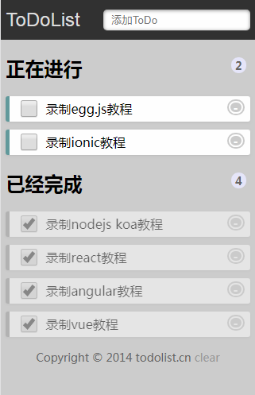

# 【第七讲】Vue3.x 实现一个完整的toDoList（待办事项） 以及类似京东App搜索缓存数据功能【前面知识综合练习】

 发布于 3 年前 作者 [phonegap100](http://bbs.itying.com/user/phonegap100) 2305 次浏览 最后一次编辑是 3 年前 来自 Vue3教程

### 一、Vue3.x中集成Sass/scsss

#### 1.1、安装sass-loader node-sass

```
npm install -D sass-loader node-sass
```

#### 1.2、style中配置sass/scss

lang可以配置scss ，scoped表示这里写的css只有当前组件有效

```
<style lang = "scss" scoped>
    h2 {
        text-align: center;
    }
</style>
```

### 二、Vue3.x 实现一个完整的toDoList（待办事项） 以及类似京东App搜索缓存数据功能



