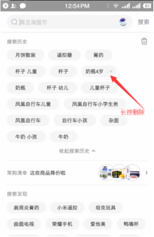

# 【第八讲】Vue3.x中的模块化以及封装Storage实现todolist 待办事项 已经完成的持久化

 发布于 3 年前 作者 [phonegap100](http://bbs.itying.com/user/phonegap100) 1819 次浏览 最后一次编辑是 3 年前 来自 Vue3教程

### 一、Vue3.x 实现一个完整的toDoList（待办事项） 以及类似京东App搜索缓存数据功能

 

### 二、 localStorage里面的方法

```
localStorage.setItem(key,value)

localStorage.getItem(key)

localStorage.removeItem(key);

localStorage.clear();
```

### 三、封装localStorage

**1、新建models/storage.js**

```
var storage={

    set(key,value){

        localStorage.setItem(key, JSON.stringify(value));
    },
    get(key){

        return JSON.parse(localStorage.getItem(key));
    },remove(key){
        localStorage.removeItem(key);
    }

}

export default storage;
```

**2、引入**

```
import storage from './model/storage.js';
```