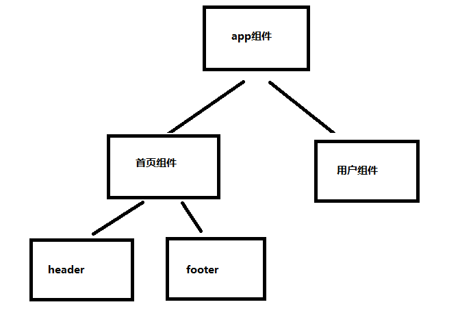

# 【第九讲】Vue3.x中的单文件组件 定义组件 注册组件 以及组件的使用

 发布于 3 年前 作者 [phonegap100](http://bbs.itying.com/user/phonegap100) 2530 次浏览 最后一次编辑是 3 年前 来自 Vue3教程

### 一、Vue3.x 中的组件

组件可以拓展html标签，解决html标签构建应用的不足，Vue项目由一个一个的组件组成。 

### 二、Vue3.x 中定义组件注册组件

**1、定义一个公共的头部组件 components/header.vue**

```
<template>
    <header> 这是一个头部组件 </header>
</template>

<script>
export default {

}
</script>

<style lang="scss">

</style>
```

**2、引入自定义组件 、注册组件、使用组件**

```
<template>
	<Header />
</template>

<script>
    import Header from './components/Header';

    export default {
        data() {
            return {
                msg: "根组件"
            };
        },
        components: {
            Header
        }

    };
</script>
```